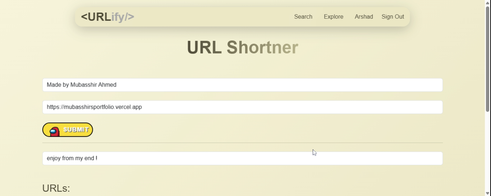
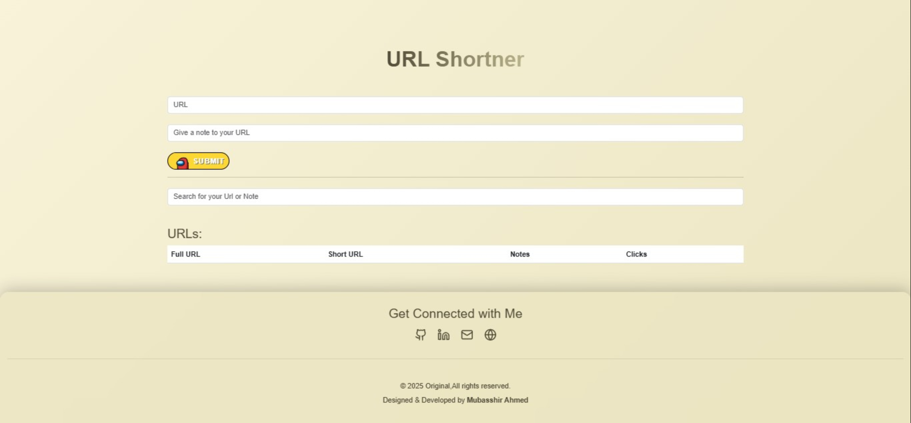

# 🚀 URLify - URL Shortener with User Authentication (MERN Stack)

URLify is a full-stack URL shortening web application built using the **MERN stack** (MongoDB, Express.js, React, Node.js). It provides user authentication, URL shortening, note storage, click tracking, and search functionality. Users can securely register, log in, manage URLs, track clicks, and search saved data efficiently.

---

## 📸 Project Screenshots

  


---

## 📚 Features

✅ **User Authentication**: Secure user registration and login using bcrypt password hashing.  
✅ **URL Shortening**: Convert long URLs into shorter, shareable links.  
✅ **Click Tracking**: Track how many times a shortened URL is clicked.  
✅ **Notes Storage**: Add personal notes to saved URLs.  
✅ **Search Functionality**: Search by short URL, long URL, or notes.  
✅ **Secure Data Handling**: Passwords hashed with bcrypt for enhanced security.  
✅ **Responsive UI**: Built with React and Bootstrap for an optimized experience across devices.

---

## 🛠️ Tech Stack

### Backend:

- Node.js
- Express.js
- MongoDB (Mongoose)
- bcrypt (Password hashing)
- shortid (Short URL generation)
- dotenv (Environment variables)
- cors (Cross-Origin Resource Sharing)
- helmet (Secure HTTP headers)
- morgan (Request logger)

### Frontend:

- React
- React Router DOM (Client-side routing)
- Axios (HTTP requests)
- Context API (Global state management)
- Bootstrap (Responsive styling)

---

## 🚀 How to Run the Project

1. Ensure **Node.js** and **MongoDB** are installed on your system.
2. Clone the repository:
   ```bash
   git clone https://github.com/your-username/urlify.git
   cd urlify
   ```
3. Install dependencies for both backend and frontend:

```

   # In the root directory

   npm install
   cd client
   npm install
```

4. Set up environment variables:
   Create a .env file in the backend folder and configure:

   ```

   MONGO_URI=your-mongodb-uri
   JWT_SECRET=your-secret-key
   CLIENT_URL=http://localhost:3000
   ```

5. Start the project:

```

# Root directory (concurrently starts backend & frontend)

npm run dev

```

6. Access the application:

```

Open your browser and navigate to:

http://localhost:3000

```

<hr/>

🔍 Internal Working

1. User Authentication
   Secure registration and login using bcrypt.
   Passwords are hashed before being stored in the database.
2. URL Shortening
   Users enter a long URL; the server generates a unique shortid.
   Each shortened URL is linked to the user's account.
3. Click Tracking
   Each click on the shortened URL increments a click counter.
4. Search Functionality
   Users can search by short URL, long URL, or notes.

📖 Learning Takeaways

1. Full-Stack Development: Integration of React, Node.js, and MongoDB.
2. Authentication: Implementing bcrypt for secure password hashing.
3. RESTful API: Building scalable and efficient CRUD endpoints.
4. State Management: Using Context API for seamless authentication flow.
5. Security: Protecting endpoints and user data using JWT, helmet, and bcrypt.
6. Debugging & Problem-Solving: Learned from practical issues and community resources.

📚 Resources & References

<li>GeeksforGeeks</li>
<li>MDN Web Docs</li>
<li>Web Dev Simplified (YouTube)</li>
<li>Stack Overflow</li>
<li>npm Documentation</li>
<li> My completed projects and Lama Dev tutorials</li>

📌 Folder Structure

```

urlify/
├── backend/
│ ├── controllers/
│ ├── models/
│ ├── routes/
│ ├── .env
│ └── server.js
├── client/
│ ├── src/
│ ├── public/
│ └── package.json
└── README.md
```

📣 Contribution Guidelines <br>
Contributions are welcome! Feel free to:

<li>Report bugs</li>
<li>Request new features</li>
<li>Open pull requests</li>


📄 License
This project is licensed under the MIT License.
Feel free to modify and use it as you like!


💙 Built with passion and MERN Stack 💙
